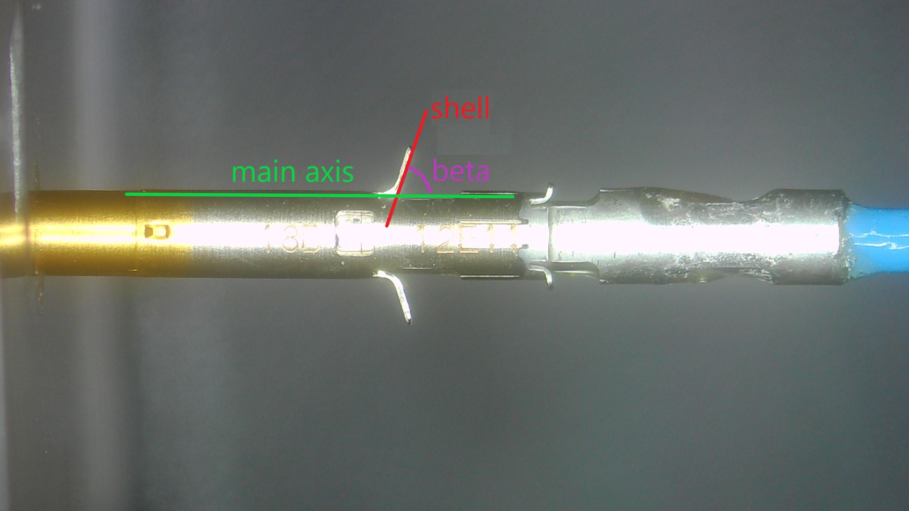

# First sub-project

### 1. Requirements

Give an image of a product taken in against a uniform background, we need to calculate the angle (beta) between shell part and body part of the object (see "guide" images). Please define a common processing chain to apply on all images from the dataset.

[All images](./data/) taken from a scene should be applied with the same parameter values (if exists).



### 2. Deployment guide

1. Install requirements

```
pip install -r requirements.txt
```

2. Run:

```
cd Project1
python main.py \
    --image_dir=[Image directory]
    --save_dir=[Save directory]
```
