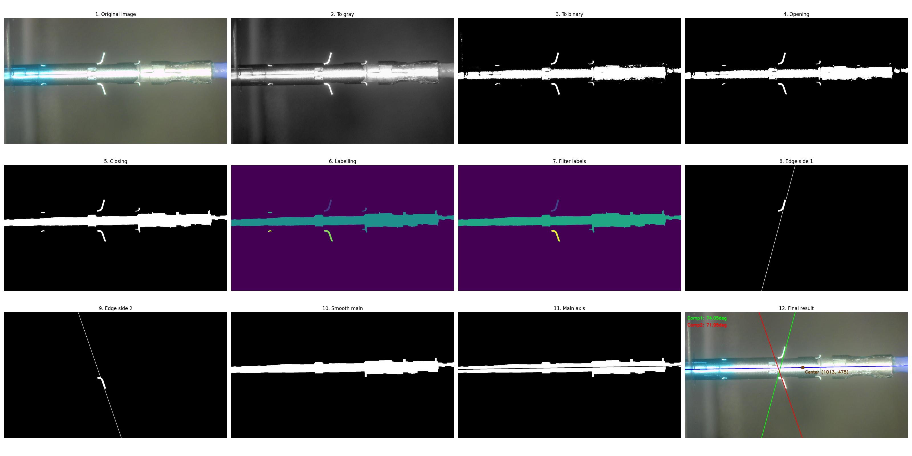
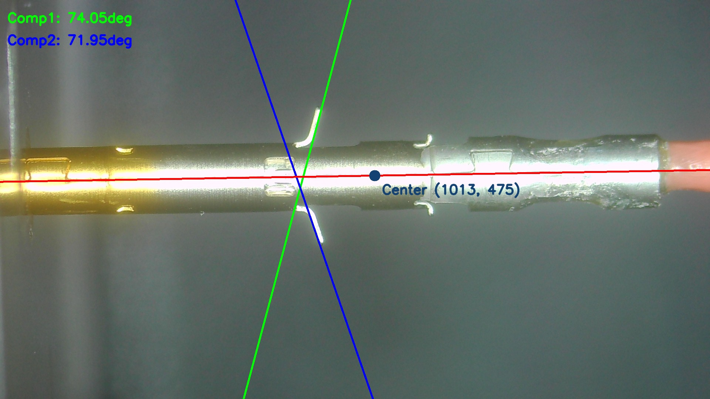

# First sub-project

### 1. Requirements

Give an image of a product taken in against a uniform background, we need to calculate the angle (beta) between shell part and body part of the object (see "guide" images). Please define a common processing chain to apply on all images from the dataset.

[All images](./data/) taken from a scene should be applied with the same parameter values (if exists).


### 2. Deployment guide

1. Install requirements

```
pip install -r requirements.txt
```

2. Run:

```
cd Project1
python main.py \
    --image_dir=[Image directory] \
    --save_dir=[Save directory]
```

### 3. Processing procedure



Processing steps:

    1. Convert image to gray image
    2. Convert gray image to binary image
    3. Do opening to remove noise
    4. Do closing to connect components
    5. Label and count all connected components
    6. Filter top 3 biggest components
    7. Find largest edge for each side components
    8. Do opening one more time to smooth main component edge
    9. Detect main component direction
    10. Calculate all necessary angles

### 4. Final result


