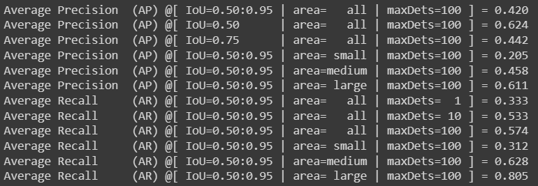
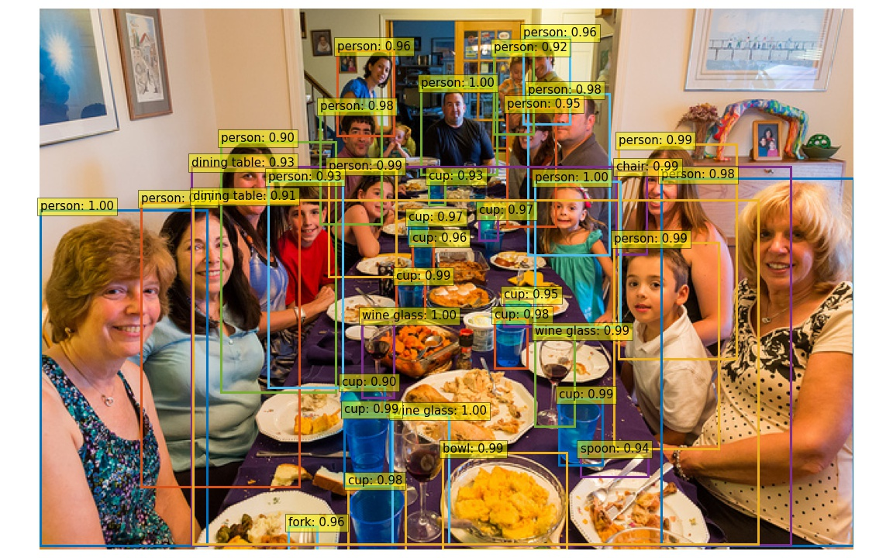
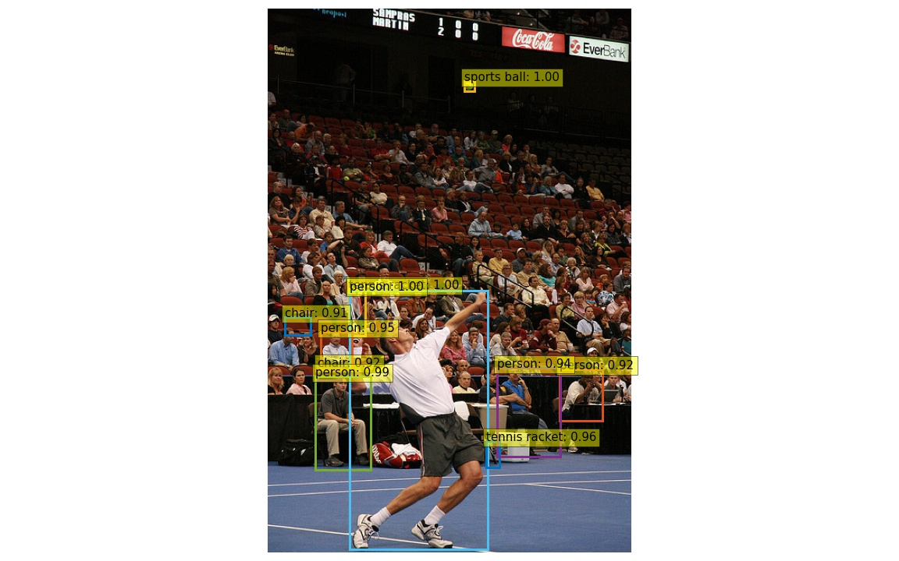
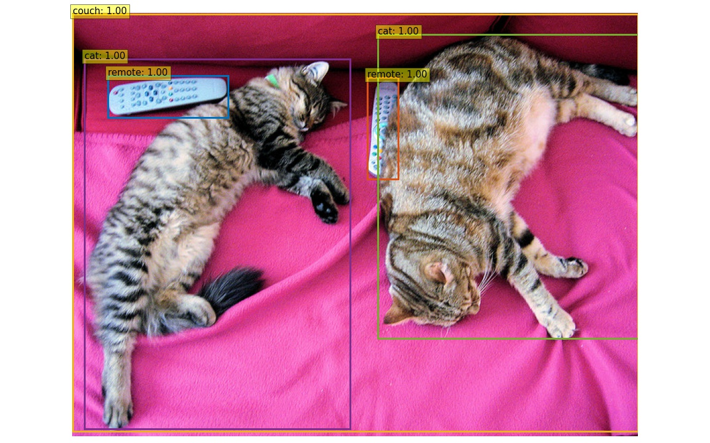
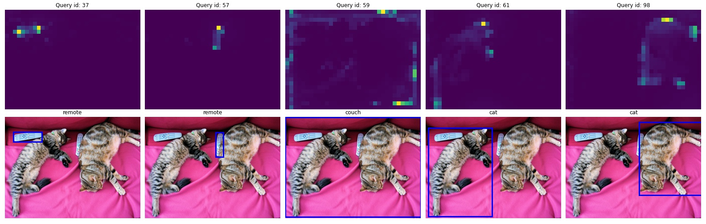
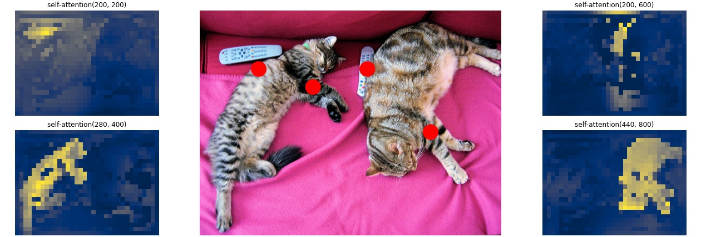

# Second sub-project

### 1. Requirements

Study a DL model for object detection, implement and evaluate the performance on public dataset. You must explain the reason for choosing the model, well understand it and analyze the obtained results.

### 2. Evaluation

- Checkpoint: DETR Resnet 50
- Dataset: COCO2017 valset
- Results:
  

### 3. Inference result

**Inference on large object**

**Inference on small object**

### 4. Visualize attention

**Original detection**

**Decoder attention**

**Encoder attention**

