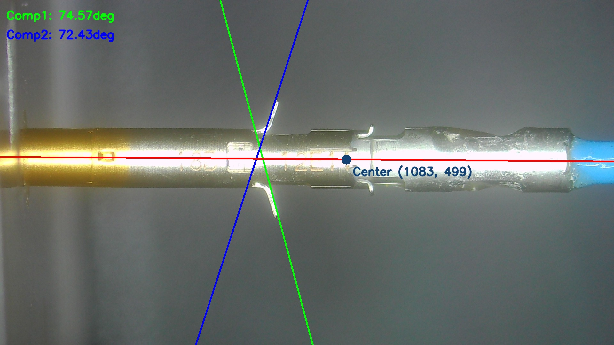
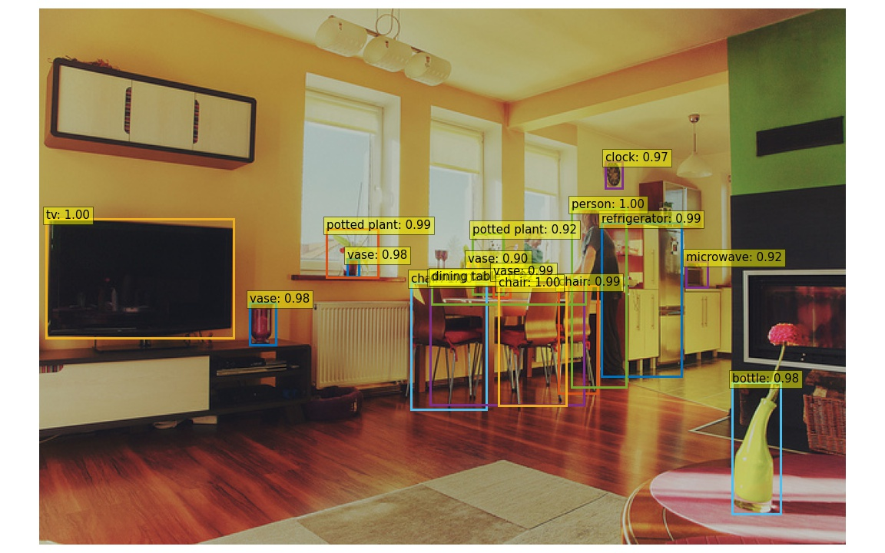

# Computer Vision Project

This project contains 2 sub-projects:

- [Project 1](./Project1): Estimate the angle of a product in a uniform background
- [Project 2](./Project2): Study a DL model for object detection, implement and evaluate the performance on public dataset

**Project 1: Angle Estimation**

**Project 2: Object detection**

